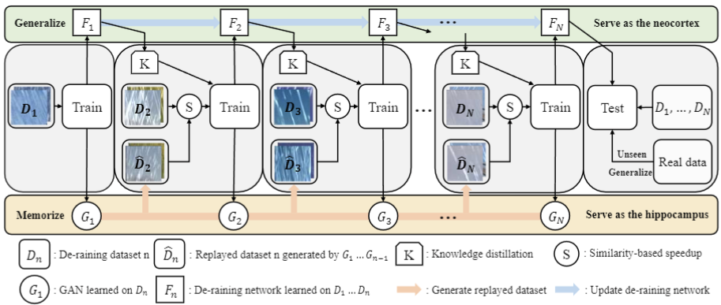
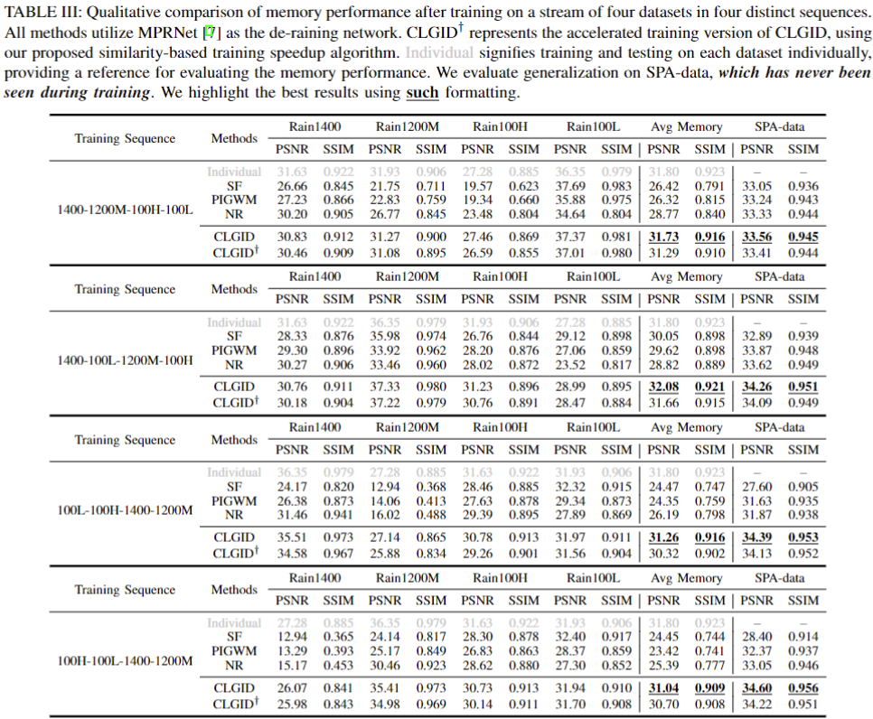

# Towards Better De-raining Generalization via Rainy Characteristics Memorization and Replay

We have released the code for our paper "Towards Better De-raining Generalization via Rainy Characteristics Memorization and Replay". Our code uses MPRNet as the exemplified de-raining network for illustrating our method.

<div align=center>

</div>

<br><br>

<div align=center>

</div>

### Datasets

[[Download link] https://pan.baidu.com/s/1oqfCJr3T_l3wFM9wpmHW7g (pwd: shdl) ]

## Install

Please refer to the requirements.txt file in the directory, where we have listed all the dependencies required for setting up the environment.

## Model Weight

[[Download link] https://pan.baidu.com/s/171LJz9gHNhrAZCzd3ZoDvg (pwd: 5jno) ]

## Structure

The folder structure should be organized as follows:

```
├── pbs
├── pytorch-gradual-warmup-lr
├── utils
├── Derain
│   ├── syn
│   │   ├── rain100H
│   │   ├── rain100L
│   │   ├── rain1400
│   │   ├── rain1200_light
│   │   ├── rain1200_medium
│   │   ├── rain1200_heavy
│   │   │   ├── train
│   │   │   │   ├── rain
│   │   │   │   ├── norain
│   │   │   ├── test
│   │   │   │   ├── rain
│   │   │   │   ├── norain
│   ├── real
│   │   ├── SPA
│   │   │   ├── rain
│   │   │   ├── norain
├── VRGNet
│   ├── rain100H
│   ├── rain100L
│   ├── rain1400
│   ├── rain1200_light
│   ├── rain1200_medium
│   ├── rain1200_heavy
├── output
...
```

## Preparation

```bash
cd CLGID
pip install natsort argparse 
cd pytorch-gradual-warmup-lr 
python setup.py install 
cd .. 
```

## Training

```bash
python train.py --yaml ./pbs/100H-100L-1400-1200m.yml
```

## Testing

```bash
python test_image.py --checkpoint your_model_pth_path --data_path ./Derain/real/SPA
```